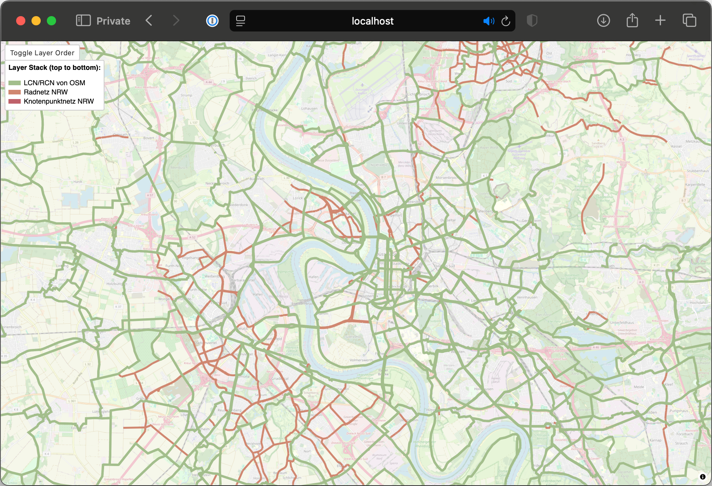

Quickly check for missing NRW cycling paths in OpenStreetMap. Any of the red paths are part of the NRW cycling network but not part of OSM.

This repo contains the processing pipeline (GPKG -> GeoJSON -> Vector tiles) and a small web app.

# Requirements

- Docker and Docker Compose must be installed and running
- No local installation of tools required (everything runs in containers)

# Quick Start

1. **Download and process data:**
   ```bash
   docker compose -f docker-compose.dataprocessing.yml up
   ```

   This only needs to run once, and whenever you feel like updating the map data.

2. **Run the full application:**
   ```bash
   docker compose -f docker-compose.runtime.yml up
   ```

3. **Access the app:**

Add these entries to `/etc/hosts`:

```
127.0.0.1 osm.app.internal
127.0.0.1 tileserver.osm.app.internal
127.0.0.1 tiles.osm.app.internal
```

The app is then available here: `http://osm.app.internal:8080`

# Data Sources

The application compares two data sources:

- **Land NRW** [publishes](https://www.radverkehrsnetz.nrw.de) cycling paths online as open data ([DL-DE->Zero-2.0](https://www.govdata.de/dl-de/zero-2-0), see the [download page](https://www.radverkehrsnetz.nrw.de/rvn_link.asp))
- **OSM data** can be queried using [Overpass](https://overpass-turbo.eu)

## Licenses
- OSM license: https://www.openstreetmap.org/copyright
- Radverkehrsnetz NRW license: DL-DE->Zero-2.0 (see https://www.radverkehrsnetz.nrw.de/rvn_link.asp)

# Development

## Data Processing

Whenever you're changing any of the scripts, remember to re-build the containers.

- **Reprocess data:** `docker compose -f docker-compose.dataprocessing.yml up --force-recreate`
- **App only:** `docker compose -f docker-compose.runtime.yml up --force-recreate`

## Frontend Development

The project uses TailwindCSS. When changing any of the HTML classes, make sure to update the CSS:
```bash
npx @tailwindcss/cli -i public/main.css -o ./src/output.css --watch
```

## Manual Data Processing (Alternative)

If you prefer to run the data processing manually instead of using Docker:

```bash
# Install tools locally
apt install tippecanoe gdal-bin curl

# Build osmtogeojson Docker
cd osmtogeojson-docker
docker build -t osmtogeojson .
cd ..

# Download and process data (change paths in the script first, currently hardcoded to /app/ for Docker)
./download-osm.sh
./download-radwege-nrw.sh
```

# Architecture

- **dataprocessor**: Downloads and processes GPKG/OSM data into vector tiles
- **tileserver**: Serves vector tiles using MapTiler TileServer GL
- **nginx**: Reverse proxy serving the web application

The data processing pipeline converts:
- NRW GPKG files → GeoJSON → MBTiles
- OSM Overpass queries → GeoJSON → MBTiles