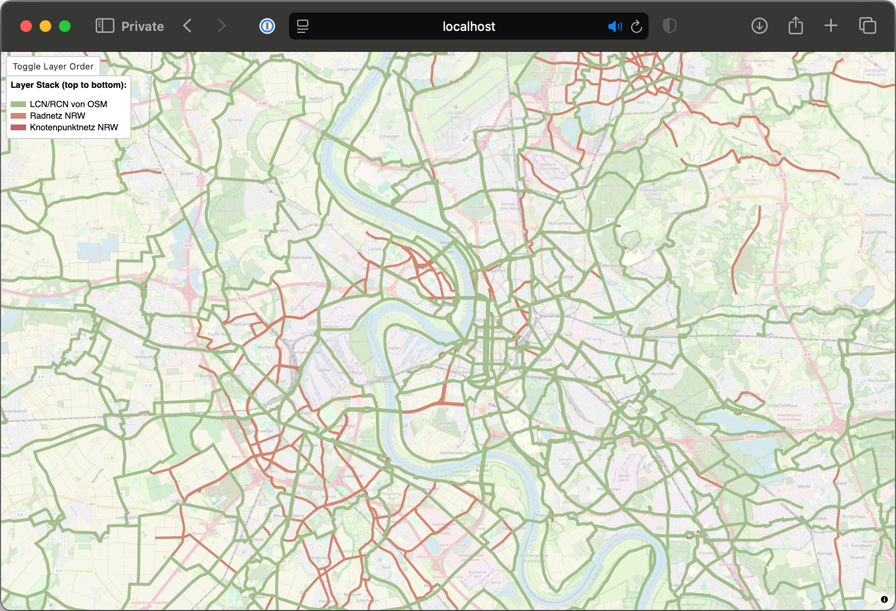

Compare the official NRW cycling network (Radverkehrsnetz NRW) against OpenStreetMap data. Highlights paths present in the NRW dataset but missing or incomplete in OSM.

---

## Requirements

- Docker and Docker Compose
- ~3 GB free disk space (downloads + tiles)

---

## Setup

### 1. Download and process data

```bash
docker compose -f docker-compose.dataprocessing.yml up
```

Downloads NRW GPKG files and the NRW OSM extract (~860 MB), then builds vector tiles. Re-run this whenever you want to refresh the data. Already-downloaded files are skipped; tiles are always regenerated.

### 2. Start the application

```bash
docker compose -f docker-compose.runtime.yml up
```

### 3. Add local DNS entries

```
127.0.0.1  osm.app.internal
127.0.0.1  tileserver.osm.app.internal
```

Add these to `/etc/hosts` (Linux/macOS) or `C:\Windows\System32\drivers\etc\hosts` (Windows).

The app is then available at **http://osm.app.internal:8080**

---

## Architecture

| Component | Image | Role |
|---|---|---|
| `dataprocessor` | Ubuntu 24.04 + gdal/osmium/tippecanoe | Downloads data, converts GPKG/OSM → GeoJSON → MBTiles |
| `tileserver` | maptiler/tileserver-gl | Serves vector tiles from MBTiles files |
| `nginx` | nginx | Serves the frontend, proxies tile requests, caches tiles |

### Data pipeline

**NRW official data:**
GPKG (EPSG:25832) → `ogr2ogr` (reproject to WGS84) → GeoJSON → `tippecanoe` → MBTiles

**OSM data:**
Geofabrik PBF → `osmium` (filter by tags) → PBF → `osmium export` → GeoJSON → `tippecanoe` → MBTiles

### Tile sources

| MBTiles file | Content |
|---|---|
| `radnetz_nw.mbtiles` | NRW cycling network lines |
| `knotenpunktnetz_nw.mbtiles` | NRW junction network lines |
| `knotenpunkte_nw.mbtiles` | NRW junction nodes |
| `radnetz_rcn_osm.mbtiles` | OSM regional cycling routes |
| `knotenpunktnetz_osm.mbtiles` | OSM cycling junction network |
| `knotenpunkte_osm.mbtiles` | OSM cycling junction nodes |

---

## Frontend

Static files in `public/`. No build step required — uses `@tailwindcss/browser` (bundled in `public/thirdparty/`) for CSS generation at runtime.

If you update `public/thirdparty/tailwindcss-browser.js`:
```bash
npm install @tailwindcss/browser
cp node_modules/@tailwindcss/browser/dist/index.global.js public/thirdparty/tailwindcss-browser.js
```

Map style is defined in `public/style.json`.

---

## Updating data

```bash
# Re-run data processing (skips downloads if files are current)
docker compose -f docker-compose.dataprocessing.yml up

# Force re-download of NRW data
rm data/.nrw_meta && docker compose -f docker-compose.dataprocessing.yml up

# Force re-download of OSM data
rm data/.osm_meta && docker compose -f docker-compose.dataprocessing.yml up
```

If tiles don't appear after a re-run, check the tileserver logs and confirm the MBTiles files are non-empty.

---

## Data sources and licenses

- **Radverkehrsnetz NRW**: [radverkehrsnetz.nrw.de](https://www.radverkehrsnetz.nrw.de) — [DL-DE→Zero-2.0](https://www.govdata.de/dl-de/zero-2-0)
- **OpenStreetMap**: [openstreetmap.org](https://www.openstreetmap.org) — [ODbL](https://www.openstreetmap.org/copyright)
- **Geofabrik NRW extract**: [download.geofabrik.de](https://download.geofabrik.de/europe/germany/nordrhein-westfalen.html)
